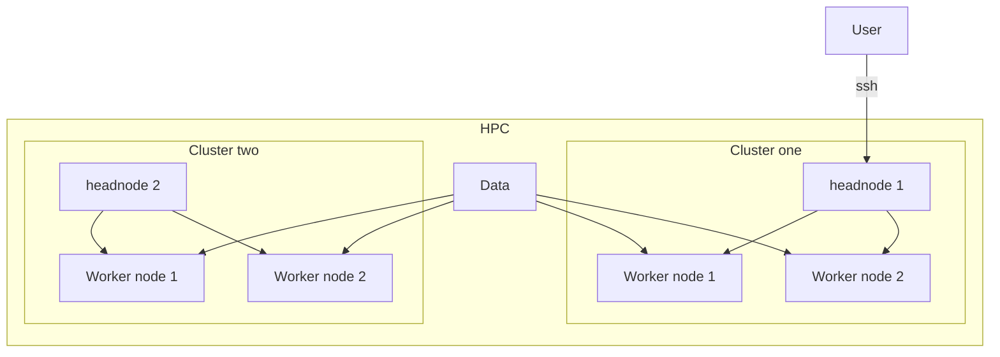

# What is HPC and why using it?

**High performance computing** (HPC) generally refers to processing complex calculations at high speeds across multiple servers in parallel. Those groups of servers are known as clusters and are composed of **hundreds or even thousands of compute servers** that have been connected through a network. 

With the increased use of technologies like the Internet of Things (IoT), artificial intelligence (AI), and machine learning (ML), organizations are producing huge quantities of data, and they need to be able to process and use that data more quickly in real-time. To power the analysis of such large dataset it is often more practical / mandatory to make use of supercomputing. Supercomputing enables fast processing of data and training of complex algorithms such as neural networks for image and sound recognition.

In Chapter 1 we explore the basics of HPC and we will learn more in depth about **UNINETT Sigma2**, a Norwegian infrastructure providing large scale computational resources.

## Basic vocabulary

### Cluster

An HPC cluster is a **collection of many separate servers (computers)**, called nodes, which are connected via a fast interconnect.

### Node

HPC clusters are composed of:

- a **headnode**, where users log in
- a specialized data transfer node
- regular compute nodes (where majority of computations is run)
- GPU nodes (on these nodes computations can be run both on CPU cores and on a Graphical Processing Unit)
 
**All cluster nodes have the same components as a laptop or desktop**: CPU cores, memory and disk space. The difference between personal computer and a cluster node is in **quantity, quality and power of the components**.

### Synthesis

*Figure 1: Graph representing the structure of an HPC. The user first has to connect to the headnode of one of the HPC clusters through ssh (or any other protocols). The user can then submit a script (i.e. a job script) that is interpreted by the headnode. The headnode distribute the tasks accross the worker nodes. The worker nodes execute the script and if needed fetch the data necessary to complete the task*