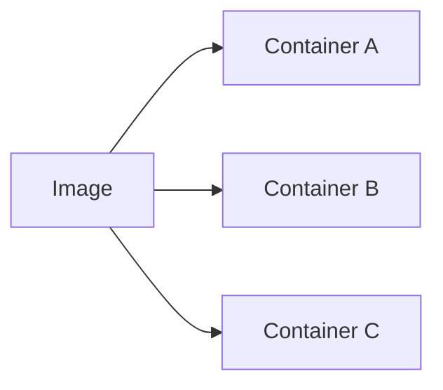

# Container technology

A container is a standard unit of software that packages up code and all its dependencies so the application runs quickly and reliably from one computing environment to another. [^1]

Containers are a solution to the problem of how to get software to run reliably when moved from one computing environment to another. For example, containers can be used to export the training of a ML model from your local machine to a HPC server without the strain of installing all the dependancies necessary to run the training. Think of a container as a shipping container for software — it holds important content like files and programs so that an application can be delivered efficiently from producer to consumer.

To create and use *containers* the use of a *container platform* is necessary. **Docker** is the most popular but others exist such as [podman](https://podman.io/). On the other hand, **Docker** and similar have some limitations which makes it difficult to use on HPC clusters and more powerful platform such as [Singularity](https://docs.sylabs.io/guides/3.5/user-guide/introduction.html) are necessary.

Since this document focus primarily on using HPC we will go through **Singularity** in more details.

## Docker

Docker, a subset of the Moby project, is a software framework for building, running, and managing containers on servers and the cloud. 

## Singularity

Singularity was created to **run complex applications on HPC clusters** in a simple, portable, and reproducible way. First developed at **Lawrence Berkeley National Laboratory**, it quickly became popular at other HPC sites, academic sites, and beyond. Singularity is an open-source project, with a friendly community of developers and users. The user base continues to expand, with Singularity now used across industry and academia in many areas of work.

## Images 

### Image versus container

A container is a **virtualized runtime environment used in application development**. It is used to create, run and deploy applications that are isolated from the underlying hardware. A container can use one machine, share its kernel and virtualize the OS to run more isolated processes. As a result, containers are lightweight.

An image is **like a snapshot in other types of VM environments**. It is a record of a Docker container at a specific point in time. Docker images are also immutable. While they can't be changed, they can be duplicated, shared or deleted. The feature is useful for testing new software or configurations because whatever happens, the image remains unchanged.

**Containers need a runnable image to exist**. Containers are dependent on images, because they are used to construct runtime environments and are needed to run an application. [^2]

*Figure X: The image is a single file with all the dependancies and configurations to run a program. Containers are instances of an image.*

### Image regristry

The Registry is a stateless, highly scalable server side application that stores and lets you **distribute Docker images**. Registries can be private, for instance some institutes or companies have internal registries to share images amongst teams but it is also possible to share images on **public** registries such as [Docker Hub](https://hub.docker.com/), [GitLab registry](https://docs.gitlab.com/ee/user/packages/container_registry/) or the [GitHub registry](https://docs.github.com/en/packages/working-with-a-github-packages-registry/working-with-the-container-registry).

---

[^1]: Definition from [docker.com](https://www.docker.com/resources/what-container/)

[^2]: Definition from [techtarget.com](https://www.techtarget.com/searchitoperations/definition/Docker-image)

